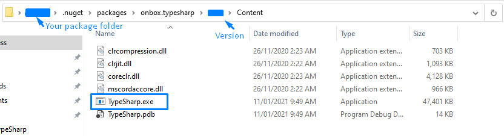

# Onbox.TypeSharp  
Commandline app to convert CSharp data models into Typescript:


## Instalation via Nuget
1. Install via Visual Studio Package Manager or Open commandline (inside a dotnet project folder) and type:
```Install-Package Onbox.TypeSharp```
2. cd into the "packages\Onbox.TypeSharp\{version}\Content" folder
3. Execute commands against .\TypeSharp.exe as shown on example sections below


## Instalation via Release download
1. Go to https://github.com/engthiago/Onbox.TypeSharp/releases and downlaod the latest version
2. Unzip the contents
3. cd into the folder 
4. Execute commands against .\TypeSharp.exe as shown on example sections below

## Commmandline options
``` -s or --source ``` **Required** <br/>
The full path name of the folder to be converted and/or to be watched. Sub diretories will also be considered. This path is not case sensitive. Relative paths work.

``` -f or --file-filter ``` **Required** <br/>
Filters the assemblies (just pure assembly names not full name) to be converted. This filter is not case sensitive.

``` -t or --type-filter ``` **Optional** <br/>
Filters the types (fully qualified names) to be converted. This filter is not case sensitive. Notice that if another model depends on ignored ones, they will still be converted.

``` -d or --destination ``` **Required** <br/>
The full path name of the folder where the Typescript files will be saved. Relative paths work.

``` -w or --watch ``` **Optional** <br/>
Tells the app to watch the destination folder and re-run everytime something changes.

``` -m or --export-module ``` **Optional** <br/>
Creates an exports module file containing all converted models.

## Example 1
Converts all the types from one assembly and dumps them into a models folder on the desktop:
```
.\TypeSharp.exe --source "C:\repos\Onbox.TypeSharp\samples\SampleModels\bin\Debug\netstandard2.0" --file-filter "SampleModels.dll" --destination "C:\Users\MyUser\Desktop\Models"
```

## Example 2
Converts all the types from all assemblies in a folder and dump them into a models folder on the desktop:
```
.\TypeSharp.exe --source "C:\repos\Onbox.TypeSharp\samples\SampleModels\bin\Debug\netstandard2.0" --file-filter "*.dll" --destination "C:\Users\MyUser\Desktop\Models"
```

## Example 3
Converts only types that contains Web.Models on their fully qualified names from one assembly and dumps them into a models folder on the desktop:
```
.\TypeSharp.exe --source "C:\repos\Onbox.TypeSharp\samples\SampleModels\bin\Debug\netstandard2.0" --file-filter "*.dll" --type-filter "Web.Models" --destination "C:\Users\MyUser\Desktop\Models"
```

## Example 4
Watches a assembly so everytime it changes, converts all the types and dumps them into a models folder on the desktop:
```
.\TypeSharp.exe --source "C:\repos\Onbox.TypeSharp\samples\SampleModels\bin\Debug\netstandard2.0" --file-filter "*.dll" --destination "C:\Users\MyUser\Desktop\Models"
```

## Example 5
Msbuild Target for running TypeSharp after build. You could add multiple runs of TypeSharp by adding more <Exec> tags:
```
<Project>
  <Target Name="TypeSharp" AfterTargets="CoreBuild">
    <Exec Command="..\..\typesharp\TypeSharp.exe --source bin\$(Configuration) --file-filter Web.Models.dll --destination ..\angular-app\src\dtos" />
  </Target>
</Project>
```

## Advantages
* Doesn't depend o Visual Studio
* .Net5 based, so it runs wherever dotnet runs
* Can be incorporated into MSBuild
* Can be incorporated into CI pipelines
* Lightweight
* Can watch assemblies for changes

## Disadvantages
* Can not load runtime dependencies like Microsoft.AspNetCore.Mvc, so it can not run against ASP.NetCore assemblies

## Dev-Dependencies
* [Onbox.Di](https://www.nuget.org/packages/Onbox.Di)
* [Onbox.Core](https://www.nuget.org/packages/Onbox.Core)
* [CommandLineParser](https://www.nuget.org/packages/CommandLineParser)

## Runtime Dependencies
All runtime dependencies are already packaged when installed. Not even .Net5 is needed, since everything is bundled in the exe.
