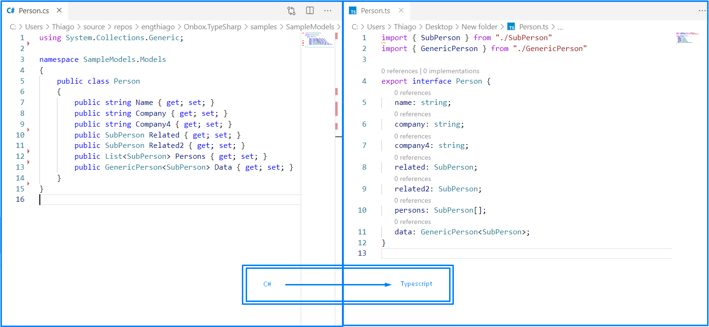

# Onbox.TypeSharp 
Commandline app to convert CSharp data models into Typescript:


## Advantages
* Do not depend o Visual Studio
* Dotnet 5 based, so it runs wherever dotnet runs
* Can be incorporated into MSBuild
* Can be incorporated into CI/CD
* Lightweight
* Can watch assemblies for changes

## Disadvantages
* Can not load runtime dependencies like Microsoft.AspNetCore.Mvc, so it can not run against ASP.NetCore assemblies

## Commmandline options
``` -s or --source ``` **Required** <br/>
The full path name of the folder to be converted and/or to be watched. Sub diretories will also be considered. This path is not case sensitive.

``` -f or --file-filter ``` **Required** <br/>
Filters the assemblies (just pure assembly names not full name) to be converted. This filter is not case sensitive.

``` -t or --type-filter ``` **Optional** <br/>
Filters the types (fully qualified names) to be converted. This filter is not case sensitive. Notice that if another model depends on ignored ones, they will still be converted.

``` -d or --destination ``` **Required** <br/>
The full path name of the folder where the Typescript files will be saved.

``` -w or --watch ``` **Optional** <br/>
Tells the app to watch the destination folder and re-run everytime something changes.

## Example 1
Converts all the types from one assembly and dumps them into a models folder on the desktop:
```
TypeSharp.exe --source "C:\repos\Onbox.TypeSharp\samples\SampleModels\bin\Debug\netstandard2.0" --file-filter "SampleModels.dll" --destination "C:\Users\MyUser\Desktop\Models"
```

## Example 2
Converts all the types from all assemblies in a folder and dump them into a models folder on the desktop:
```
TypeSharp.exe --source "C:\repos\Onbox.TypeSharp\samples\SampleModels\bin\Debug\netstandard2.0" --file-filter "*.dll" --destination "C:\Users\MyUser\Desktop\Models"
```

## Example 3
Converts only types that contains Web.Models on their fully qualified names from one assembly and dumps them into a models folder on the desktop:
```
TypeSharp.exe --source "C:\repos\Onbox.TypeSharp\samples\SampleModels\bin\Debug\netstandard2.0" --file-filter "*.dll" --type-filter "Web.Models" --destination "C:\Users\MyUser\Desktop\Models"
```

## Example 4
Watches a assembly so everytime it changes, converts all the types and dumps them into a models folder on the desktop:
```
TypeSharp.exe --source "C:\repos\Onbox.TypeSharp\samples\SampleModels\bin\Debug\netstandard2.0" --file-filter "*.dll" --destination "C:\Users\MyUser\Desktop\Models"
```

## Dependencies
* [Onbox.Di](https://www.nuget.org/packages/Onbox.Di)
* [CommandLineParser](https://www.nuget.org/packages/CommandLineParser)
