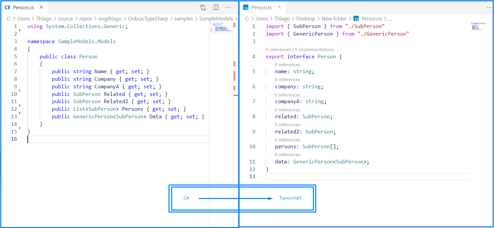

# Onbox.TypeSharp

Convert C# DTO source files into TypeScript interfaces and enums.

TypeSharp is a Node-powered TypeScript CLI. It reads `.cs` files directly, parses simple DTO models, and writes one `.ts` file per DTO or enum.



## Requirements

- [Node.js](https://nodejs.org/)
or 
- [Deno](https://deno.com/)

## Usage

Run TypeSharp with Deno:

```bash
deno run -A src/main.ts \
  --source "./samples/SampleModels" \
  --file-filter "*.cs" \
  --destination "./samples/SampleModels/Typescript" \
  --export-module
```

Or use a config file:

```bash
deno run -A src/main.ts --config "./typesharp.json"
```

With node (tsx):

```bash
npx tsx src/main.ts
```

With node (build the project then run with node)

```bash
npm run build && node ./dist/main.js
```

When `--config` is not provided, TypeSharp reads `typesharp.json` from the current folder if it exists. Command-line options override config file values.

## Command-Line Options

`-c`, `--config` optional  
Path to a JSON configuration file. Default: `./typesharp.json` when that file exists.

`-s`, `--source` required unless set in config  
Folder containing `.cs` files. Subfolders are included.

`-f`, `--file-filter` optional  
Glob-style filter for source files, such as `*.cs` or `*Dto.cs`. Default: `*.cs`.

`-x`, `--exclude-pattern` optional  
Glob-style source file exclude pattern. Can be repeated or passed as a comma-separated list, such as `*Attributes.cs,*Internal.cs`. Patterns are matched against file names and source-relative paths. Default: none.

`-t`, `--type-filter` optional  
Glob-style filter for parsed type names, such as `Person*`. Default: all parsed types.

`-d`, `--destination` required unless set in config  
Folder where generated TypeScript files are written.

`-w`, `--watch` optional  
Watches the source folder and regenerates when `.cs` files change. Default: `false`.

`-m`, `--export-module` optional  
Creates an aggregate module file that re-exports generated files. Default: `false`.

`--dictionary-style` optional  
Controls dictionary output. Options: `index-signature`, `record`. Default: `index-signature`.

`--readonly-properties` optional  
Emits all interface properties as `readonly`. Default: `false`.

`--quote-style` optional  
Controls generated string quotes. Options: `double`, `single`. Default: `double`.

`--semicolons`, `--no-semicolons` optional  
Controls semicolons on generated TypeScript statements. Options: `true`, `false`. Default: `true`.

`--normalize-acronyms`, `--no-normalize-acronyms` optional  
Normalizes leading acronyms in generated property names, such as `ULS` to `uls`. Default: `false`.

`--preserve-comments`, `--no-preserve-comments` optional  
Emits parsed C# comments in generated TypeScript files. Default: `false`.

`--convert-documentation-comments`, `--no-convert-documentation-comments` optional  
Converts C# XML documentation comments (`///`) into TypeScript JSDoc comments. Default: `false`.

`--inline-inherited-properties`, `--no-inline-inherited-properties` optional  
Adds properties from inherited classes and interfaces directly into the generated interface body. Default: `false`.

## Configuration File

Create `typesharp.json`:

```json
{
  "source": "./samples/SampleModels",
  "fileFilter": "*.cs",
  "excludePatterns": ["*Attributes.cs", "*Internal.cs"],
  "typeFilter": "*",
  "destination": "./samples/SampleModels/Typescript",
  "watch": false,
  "exportModule": true,
  "dictionaryStyle": "record",
  "readonlyProperties": false,
  "quoteStyle": "double",
  "semicolons": true,
  "normalizeAcronyms": false,
  "preserveComments": false,
  "convertDocumentationComments": false,
  "inlineInheritedProperties": false
}
```


Override config values from the command line:

```bash
deno run -A src/main.ts \
  --config "./config/tssharp.json" \
  --dictionary-style record \
  --readonly-properties \
  --quote-style single \
  --no-semicolons
```

## Supported C# Input

TypeSharp supports DTO-focused C# source files:

- `namespace`
- `public class`
- generic classes
- simple inheritance
- `public enum`
- attributes
- public auto-properties
- private, protected, internal, and implicit interface properties are ignored
- primitive types
- `object`
- `DateTime` and `DateTimeOffset`
- nullable shorthand, such as `int?`
- arrays
- `List<T>` and other common collection interfaces
- `Dictionary<TKey, TValue>`
- nested generics
- custom DTO and enum references parsed from source

## Supported Attributes

TypeSharp recognizes these attributes on properties:

- `[Optional]` emits an optional TypeScript property.
- `[Nullable]` adds `| null`.
- `[UnknownObject]` emits `unknown`.
- `[Partial]` wraps the property type in `Partial<T>`.
- `[TypeUnion(...)]` emits literal unions.
- `[Readonly]` or `[ReadOnly]` emits a readonly property.

TypeSharp also recognizes these attributes on classes:

- `[Readonly]`, `[ReadOnly]`, or `[ReadonlyProperties]` emits all properties on that interface as readonly.

## Examples

C# input:

```csharp
namespace SampleModels.Models
{
    [Readonly]
    public class Person
    {
        public string Name { get; set; }
        public Dictionary<string, Address> Addresses { get; set; }

        [Optional]
        [TypeUnion("admin", "user")]
        public string Role { get; set; }
    }
}
```

Generated TypeScript with `dictionaryStyle` set to `record`:

```ts
import { Address } from "./Address";

export interface Person {
   readonly name: string;
   readonly addresses: Record<string, Address>;
   readonly role?: "admin" | "user";
}
```

Aggregate module output:

```ts
export * from "./Address";
export * from "./Person";
```

## Development

Test:

```bash
npm rum test
```
